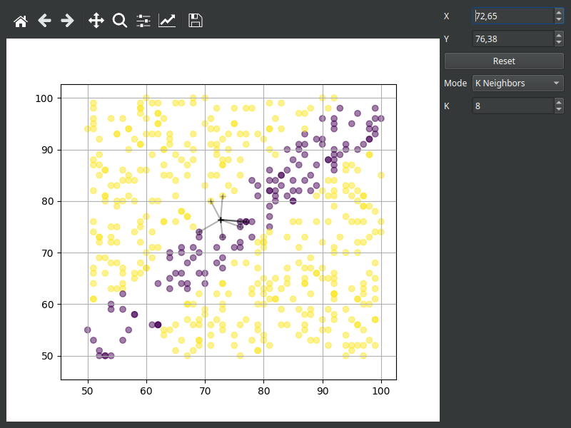

# k-nearest neighbors visualization

This is a prototype of a k-nearest neighbors visualization  to test the practicability of Matplotlib in combination with Qt to create interactive visualizations.



> **_NOTE:_**  The classification of the set position isn't done yet.

## Quick start

New to whatever that is? This guide is mostly copied from the [Qt for Python](https://doc.qt.io/qtforpython-6/quickstart.html) quick start page.

- [NumPy](https://numpy.org/)
- [SciPy](https://scipy.org/)
- [PySide6](https://doc.qt.io/qtforpython-6/index.html)
- [Matplotlib](https://matplotlib.org/)

## Requirements

Before you can install Qt for Python and TensorFlow, first you must install the following software:

- Python 3.7+
- We recommend using a virtual environment, such as `venv` or `virtualenv`

## Installation

### Creating and activating an environment

Create environment (Your Python executable might be called python3):
```
python -m venv env
```
Activate the environment (Linux and macOS):
```
source env/bin/activate
```
Activate the environment (Windows):
```
env\Scripts\activate.bat
```

### Installing NumPy, SciPy, PySide6 and Matplotlib

Now you are ready to install the NumPy, SciPy, Qt for Python and Matplotlib packages using `pip`. From the terminal, run the following command for the latest version:
```
pip install numpy scipy pyside6 matplotlib
```

## Usage

### Running the application

```
python3 main.py
```

### Exiting the virtual environment

```
deactivate
```